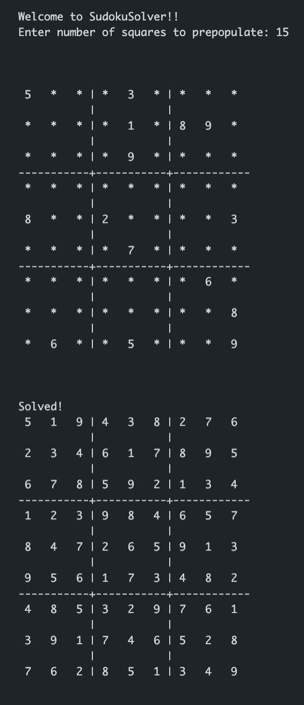

# Sudoku Solver

This program takes a number of squares to pre-populate and then generates a valid (although not necessarily solvable) Sudoku puzzle and prints it to the console. The program then uses a backtracking algorithm to programmatically check for valid solutions. When a correct solution is found the solved puzzle is printed. 

